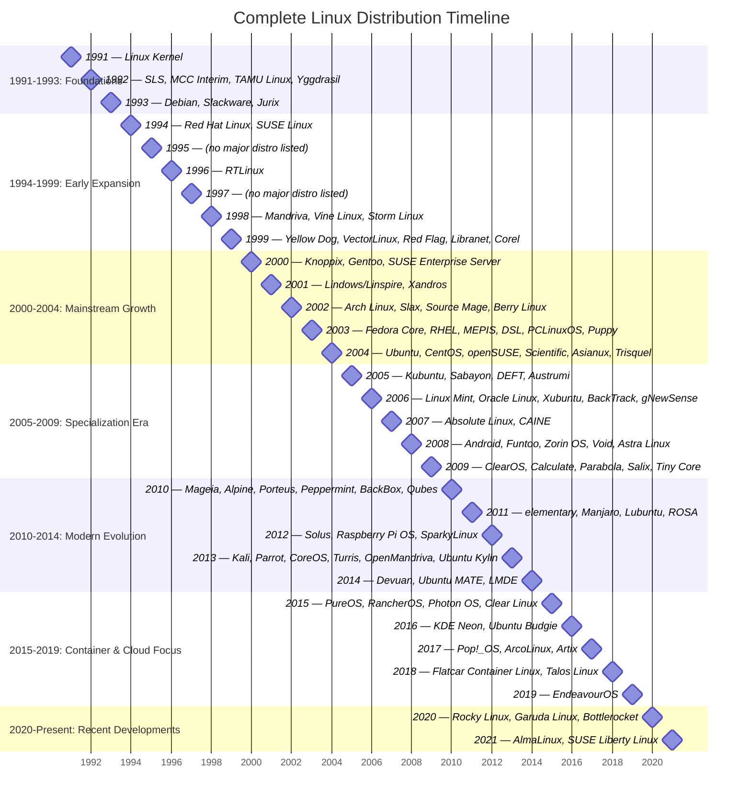

```mermaid
gantt
    title Complete Linux Distribution Timeline
    dateFormat YYYY-MM-DD
    axisFormat %Y

    section 1991-1993: Foundations
    1991 — Linux Kernel                                   :milestone, m1991, 1991-01-01, 1d
    1992 — SLS, MCC Interim, TAMU Linux, Yggdrasil       :milestone, m1992, 1992-01-01, 1d
    1993 — Debian, Slackware, Jurix                       :milestone, m1993, 1993-01-01, 1d

    section 1994-1999: Early Expansion
    1994 — Red Hat Linux, SUSE Linux                      :milestone, m1994, 1994-01-01, 1d
    1995 — (no major distro listed)                       :milestone, m1995, 1995-01-01, 1d
    1996 — RTLinux                                        :milestone, m1996, 1996-01-01, 1d
    1997 — (no major distro listed)                       :milestone, m1997, 1997-01-01, 1d
    1998 — Mandriva, Vine Linux, Storm Linux              :milestone, m1998, 1998-01-01, 1d
    1999 — Yellow Dog, VectorLinux, Red Flag, Libranet, Corel :milestone, m1999, 1999-01-01, 1d

    section 2000-2004: Mainstream Growth
    2000 — Knoppix, Gentoo, SUSE Enterprise Server        :milestone, m2000, 2000-01-01, 1d
    2001 — Lindows/Linspire, Xandros                      :milestone, m2001, 2001-01-01, 1d
    2002 — Arch Linux, Slax, Source Mage, Berry Linux     :milestone, m2002, 2002-01-01, 1d
    2003 — Fedora Core, RHEL, MEPIS, DSL, PCLinuxOS, Puppy:milestone, m2003, 2003-01-01, 1d
    2004 — Ubuntu, CentOS, openSUSE, Scientific, Asianux, Trisquel :milestone, m2004, 2004-01-01, 1d

    section 2005-2009: Specialization Era
    2005 — Kubuntu, Sabayon, DEFT, Austrumi               :milestone, m2005, 2005-01-01, 1d
    2006 — Linux Mint, Oracle Linux, Xubuntu, BackTrack, gNewSense :milestone, m2006, 2006-01-01, 1d
    2007 — Absolute Linux, CAINE                           :milestone, m2007, 2007-01-01, 1d
    2008 — Android, Funtoo, Zorin OS, Void, Astra Linux    :milestone, m2008, 2008-01-01, 1d
    2009 — ClearOS, Calculate, Parabola, Salix, Tiny Core  :milestone, m2009, 2009-01-01, 1d

    section 2010-2014: Modern Evolution
    2010 — Mageia, Alpine, Porteus, Peppermint, BackBox, Qubes :milestone, m2010, 2010-01-01, 1d
    2011 — elementary, Manjaro, Lubuntu, ROSA               :milestone, m2011, 2011-01-01, 1d
    2012 — Solus, Raspberry Pi OS, SparkyLinux              :milestone, m2012, 2012-01-01, 1d
    2013 — Kali, Parrot, CoreOS, Turris, OpenMandriva, Ubuntu Kylin :milestone, m2013, 2013-01-01, 1d
    2014 — Devuan, Ubuntu MATE, LMDE                        :milestone, m2014, 2014-01-01, 1d

    section 2015-2019: Container & Cloud Focus
    2015 — PureOS, RancherOS, Photon OS, Clear Linux        :milestone, m2015, 2015-01-01, 1d
    2016 — KDE Neon, Ubuntu Budgie                          :milestone, m2016, 2016-01-01, 1d
    2017 — Pop!_OS, ArcoLinux, Artix                       :milestone, m2017, 2017-01-01, 1d
    2018 — Flatcar Container Linux, Talos Linux            :milestone, m2018, 2018-01-01, 1d
    2019 — EndeavourOS                                      :milestone, m2019, 2019-01-01, 1d

    section 2020-Present: Recent Developments
    2020 — Rocky Linux, Garuda Linux, Bottlerocket         :milestone, m2020, 2020-01-01, 1d
    2021 — AlmaLinux, SUSE Liberty Linux                   :milestone, m2021, 2021-01-01, 1d
```
